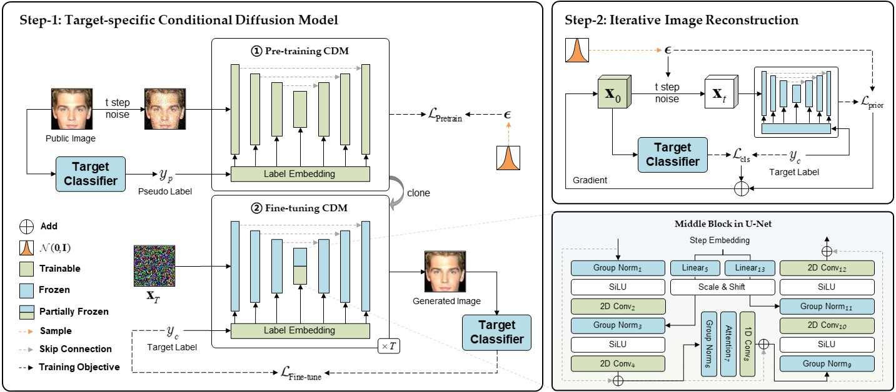
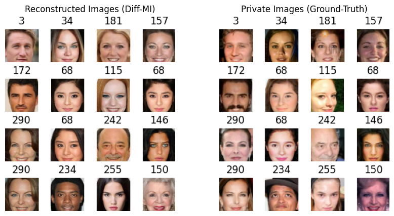
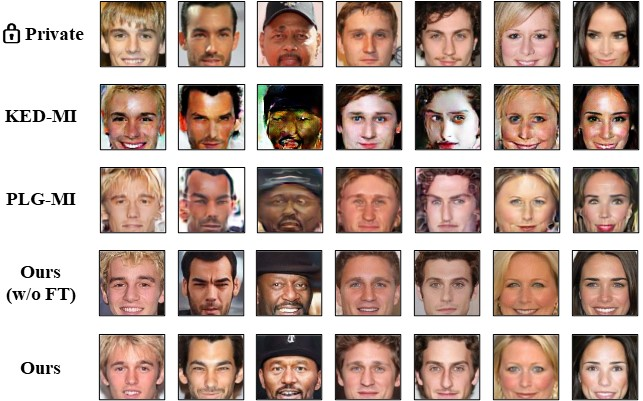

# Diff-MI

This is the official Pytorch implementation of our paper:

> [Model Inversion Attacks through Target-specific Conditional Diffusion Models](https://www.arxiv.org/abs/2407.11424)
>
>  Ouxiang Li, Yanbin Hao, Zhicai Wang, Shuo Wang, Zaixi Zhang, FuliFeng



## Requirements

Install the environment as follows:

```python
# create conda environment
conda create -n Diff-MI -y python=3.9
conda activate Diff-MI
# install pytorch 
pip install torch==1.13.1 torchvision==0.14.1
# install other dependencies
pip install -r requirements.txt
bash conda_package_modifier.sh
```

## Preparation

### Data Collection

- **Public datasets:** We use [CelebA](https://mmlab.ie.cuhk.edu.hk/projects/CelebA.html), [FFHQ](https://drive.google.com/open?id=1tg-Ur7d4vk1T8Bn0pPpUSQPxlPGBlGfv) and [FaceScrub](http://vintage.winklerbros.net/facescrub.html) in our experiments (we use a cleaned version of FaceScrub from this [repo](https://github.com/AI-Machine-Vision-Lab/FPVT_BMVC22-Face-Pyramid-Vision-Transformer)). You can directly download the pre-processed datasets [`reclassified_public_data`](https://rec.ustc.edu.cn/share/bd57d300-a599-11ef-81ec-2dc399cf1bb6) after top-n selection.

- **Private datasets:** We follow [KED-MI](https://github.com/SCccc21/Knowledge-Enriched-DMI/) to divide the CelebA into private and public data and use the private data of CelebA (the first 300 classes) [`celeba_private_300`](https://rec.ustc.edu.cn/share/e6523dc0-a599-11ef-b61a-f5d7b9dcce5a) for evaluation.

- **Public features:** We pre-compute the regularization features [`p_reg`](https://rec.ustc.edu.cn/share/fc0a9410-a599-11ef-a69c-87baa4572ea0) for $\mathcal{L}_{\text{p-reg}}$.

### Models

- **Classifiers:** You can train target models following [KED-MI](https://github.com/SCccc21/Knowledge-Enriched-DMI/) or direcly download the [`pretrained checkpoints`](https://rec.ustc.edu.cn/share/1e599810-a59a-11ef-98d3-bd2067401b0b) and put them in `./assets/checkpoints`.
- **Target-specific CDMs:** We additionally provide our pretrained and fine-tuned [`target-specific CDMs`](https://rec.ustc.edu.cn/share/3ebec270-a59a-11ef-ab84-5d8f154cfc23) for quick reproduction, including weights across three target classifiers `VGG16, IR152, FaceNet64` using three public datasets `celeba, ffhq, facescrub`.
- **Private features:** To calculate KNN Dist, we pre-compute [`private features`](https://rec.ustc.edu.cn/share/584b52a0-a59a-11ef-bdeb-bde5488ecd8a) on the evaluation model in and you should put them in `./assets/celeba_private_feats`.

### Directory structure

<details>
<summary> You should organize the above data as follows: </summary>

```
data
├── celeba_private
│   └── celeba_private_300
├── p_reg
│   └── celeba_VGG16_p_reg.pt
│   └── ...
├── reclassified_public_data
│   └── celeba
│   └── facescrub
│   └── ffhq
assets
├── celeba_private_feats
│   └── private_feats_mean.npy
│   └── private_feats.npy
│   └── private_targets.npy
├── checkpoints
│   └── evaluate_model
│   └── target_model
```
</details>

## Quick Visualization

To facilitate quick reproduction of our reconstructed samples, we provide a jupyter script `demo.ipynb`. You can load our pre-trained weights to quickly visualize our attack results.



## Step-1: Training Target-Specific CDM

We simulate the MIA scenario on three target classifiers `VGG16, IR152, FaceNet64` with three different public datasets `celeba, ffhq, facescrub`. Here we take `VGG16` as the target classifier and `CelebA` as the public dataset as an example to train the target-specific CDM from scratch.

### Pretrain CDM

We pretrain the CDM with batch size 150 for 50,000 iterations on two A40 GPUs. Our ablation indicates that extended training iterations (e.g., 100,000) would lead to better attack performance. The pre-trained checkpoints will be saved at `./1_pretrain/logger/`.

```
CUDA_VISIBLE_DEVICES=0,1 mpiexec -n 2 python 1_pretrain/free_train.py \
    --class_cond True \
    --batch_size 150 \
    --dataset celeba \
    --data_dir data/reclassified_public_data/celeba/VGG16_top30
```

### Fine-tune CDM

The fine-tuning stage opertates from the pretrained checkpoint with ema rate of 0.9999 (e.g., `ema_0.9999_050000.pt`). Here we set batch size to $4$ which requires around 24 GB memory on a single GPU. Notably, you can trade off the attack accuracy and generative fidelity by adjusting fine-tuning epochs and early-stop threshold with `--epoch` and `--threshold`.

```
CUDA_VISIBLE_DEVICES=0 python 2_finetune/fintune_train.py \
    --batch_size 4 \
    --dataset celeba \
    --target VGG16 \
    --resume_checkpoint {Path of pretrained checkpoint} 
```

The fine-tuned checkpoint will be saved at `./2_finetune/logger/`. 

## Step-2: Iterative Image Reconstruction 

In step-2, you can load the target-specific CDM for attack on any specific target class. Here, we reconstruct 5 images for the first 300 classes with bs = 64.

```
CUDA_VISIBLE_DEVICES=0 python 3_attack/attack.py \
    --dataset celeba \
    --target VGG16 \
    --label_num 300 \
    --repeat_times 5 \
    --batch_size 64 \
    --path_D {Path of target-specific CDM}
```

Additionally, we provide an evaluation script `./3_attack/evaluate.py` to evaluate the reconstructions of different MIA methods regarding various metrics.

```
CUDA_VISIBLE_DEVICES=0 python 3_attack/evaluate.py \
    --eval_path {Path of recontructed images} \
    --cal_acc --cal_fid --cal_knn \
    --cal_piq --cal_lpips \
    --cal_PRCD
```

<details>
<summary> The path of reconstructed images should be organized as follows: </summary>

```
Diff-MI
├── all_imgs
│   └── 0
│   └── 1
│   └── ...
│   └── 299
├── success_imgs  # optional
│   └── 0
│   └── 1
│   └── ...
│   └── 299
```
</details>

The subfolder `success_imgs` is optional, the `evaluate.py` script can automatically perform calculations based on the `all_imgs` subfolder and save the results in the corresponding format.

## Examples of Reconstructed Images



## Citing
If you find this repository useful for your work, please consider citing it as follows:
```
@article{li2024model,
  title={Model Inversion Attacks Through Target-Specific Conditional Diffusion Models},
  author={Li, Ouxiang and Hao, Yanbin and Wang, Zhicai and Zhu, Bin and Wang, Shuo and Zhang, Zaixi and Feng, Fuli},
  journal={arXiv preprint arXiv:2407.11424},
  year={2024}
}
```